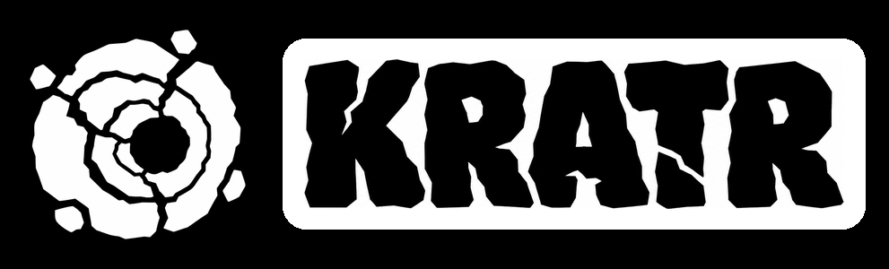
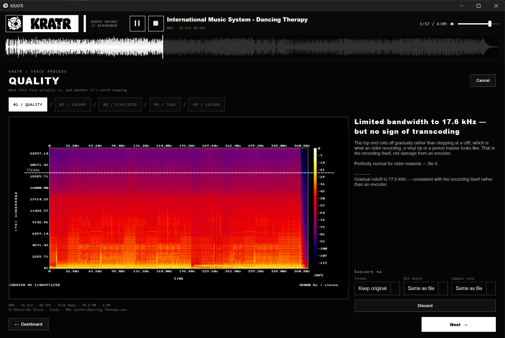

<p align="center">
  
</p>

DJ track intake for rekordbox. Drop a track in and it gets quality-checked first,
converted to the format you want, then moved into your library rather than copied. From there you can easily
import to rekordbox, selecting playlists, tags and colours. One pass, start to finish.

Replaces shuffling through multiple apps when importing your tune.

### [⬇ Download KRATR](../../releases/latest) for Windows or macOS



## Download & install

Grab the latest build from the [**Releases page**](../../releases/latest):

- **Windows** — download `KRATR-Setup-*.exe` and run it. On the blue "Windows
  protected your PC" screen, click **More info → Run anyway** (it's unsigned — normal
  for a small tool). No admin needed.
- **macOS** — download `KRATR-*.dmg`, open it, drag **KRATR** into Applications. First
  launch: **right-click KRATR → Open → Open**. Apple Silicon Macs may be asked to
  install Rosetta the first time.

ffmpeg is bundled, so there's nothing else to install. You do need
[rekordbox](https://rekordbox.com) installed and opened at least once. The first launch
runs a short setup walkthrough.

**Requirements:** rekordbox 6 or 7 · Windows 10/11, or macOS 11 (Big Sur) or newer.

> KRATR is shared as-is, with no warranty. It's built to be safe to point at a real
> library (see the safety rules below), but keep your own backups.

```
drop → quality-check → convert → genre/sub-genre folder → import to rekordbox
     → playlists → tags → colour
```

## Running it

If you installed KRATR, just open it from the Start menu (Windows) or Applications
(macOS). The console commands below — a health check and a library audit — ship as
`kratr-cli` next to the app; run them from a terminal in the install folder:

```
kratr-cli doctor     # read-only health check — run after every rekordbox update
kratr-cli audit      # scan the whole library for upscales (read-only)
kratr-cli verify     # check everything works on this machine
```

From a source checkout the equivalent is `.venv\Scripts\python.exe -m crate <command>`
(see [BUILD.md](BUILD.md)).

## The safety rules

These are not negotiable, and they're what make it safe to point at a real library.

- **Never writes while rekordbox is running.** It holds the library in memory and
  flushes on exit, so writing underneath it would lose or corrupt changes. A hard
  block, not a warning.
- **Backs up before every write session** — `master.db`, `masterPlaylists6.xml`, *and*
  the `-wal`/`-shm` sidecars. The database runs in WAL mode, so a copy of `master.db`
  alone can be missing committed changes, and a restore that leaves a stale `-wal`
  behind will have it replay straight back over the restored file.
- **Fails closed on a rekordbox update.** Every launch checks the version and a schema
  fingerprint. If something KRATR writes to has moved, writes are blocked until the
  code is fixed. If the schema merely changed, writes are held for one confirmation.
  Additive drift — rekordbox adding columns — is tolerated, not treated as breakage.
- **Existing tracks are relocated, never re-imported.** An in-place row update keeps
  the same `ContentID`, so playlists, ratings, play counts, hot cues and beatgrids all
  survive by construction.
- **One destructive operation exists** — overwriting the comment field — and every
  original is logged to `comment-backup.jsonl` first, restorable byte-for-byte.

## How the quality check works

Two outputs: a Spek-equivalent spectrogram, and a verdict.

The verdict measures the frequency cutoff against the **noise floor**, not the
spectral peak — real music has a steep tilt and a peak-relative reading puts the
cutoff far too low (a genuine 320 kbps track measured 7.7 kHz that way).

What flags an upscale is not a low cutoff on its own but a **brick wall**: lossy
encoders discard everything above their cutoff, leaving a near-vertical cliff that
nature doesn't make. Plenty of genuinely lossless older records roll off early — this
library is full of them — and they must not be condemned for it.

**Known limitation:** for a *natively* lossy file the measured cutoff is unreliable,
because a float decode preserves the decoder's own −140 dB artefacts up to Nyquist.
Those files are rated from their declared bitrate instead, which the container reports
honestly. The upscale check is unaffected — writing to 16-bit quantises those
artefacts to silence, which is exactly the case that matters.

## Tagging, and the four-slot ceiling

rekordbox has exactly **four** MyTag categories, 50 tags each, and there is no way to
add a fifth. Three further channels carry what won't fit:

| Channel | Capacity | Why |
|---|---|---|
| **MyTag** | 4 × 50 | Filterable on a CDJ |
| **Colour** | 8, single-value | The only attribute readable at a glance without opening a menu |
| **Comments** | unlimited | CDJ search covers it — `/hazy /sunset` is searchable mid-set |
| **Smart playlists** | unlimited | Auto-updating, and browsable on a CDJ instead of menu-diving |

BPM and key need no tags — the CDJ Track Filter handles both natively.

A category left at a rekordbox default name has been reported to vanish from USB
export, so KRATR always writes an explicit name to all four.

## Layout

```
crate/
  pipeline/     probe · quality · convert · filing · audit    (never touches rekordbox)
  rekordbox/    schema · session · queue · importer · mytags · colours ·
                comments · smartlists · taxonomy · doctor
  ui/           main_window · pickers · tag manager · apply dialog
```

`pipeline/` has no rekordbox dependency at all, which is why conversion, quality
checks and filing keep working even when the rekordbox layer is blocked.

## Tests

```bash
.venv\Scripts\python.exe -m pytest tests -q
```

Every rekordbox test runs against a **sandbox clone**, never the live library. Audio
fixtures are generated with ffmpeg rather than committed, so the signals are known
exactly and the quality detector can be asserted on rather than merely exercised.

## Building it yourself

Full build instructions — the Windows installer, the macOS `.app`/`.dmg`, and the
GitHub Actions release pipeline — are in [BUILD.md](BUILD.md) and [MAC-BUILD.md](MAC-BUILD.md).

The shipped apps **bundle ffmpeg** (installed next to the app on Windows, inside the
`.app` on macOS), so there's nothing to install on PATH. In a bare source checkout,
ffmpeg is instead found on PATH.
